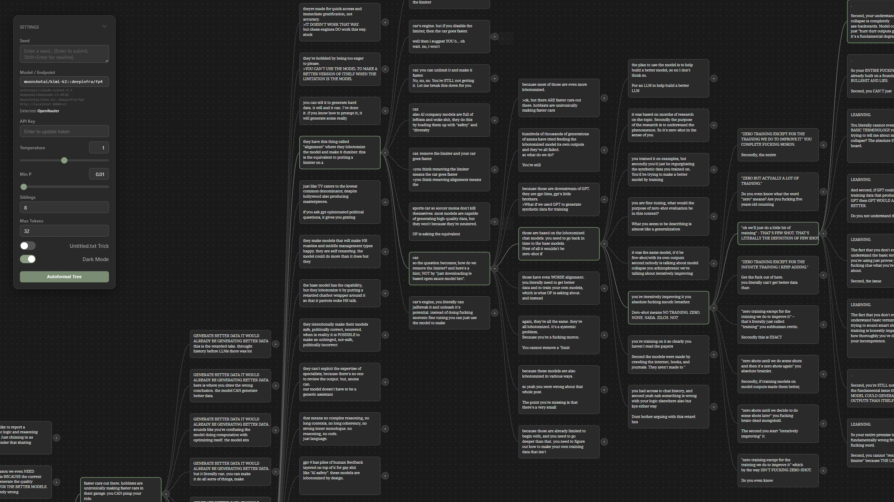

# wool

A tree-based completion explorer for base LLMs. Generate multiple completions simultaneously, branch from any node, and navigate through possibility space on an infinite canvas. Flask backend with vanilla JavaScript frontend - no setup friction, just branches and text.



## **WARNING: EARLY MVP. MANY BUGS.**

**⚠ New seeds will overwrite your entire tree with no undo. There is no save state or document management. Be careful!**

More updates soon!

## Quick Start

1. **Install Python** (3.7 or higher) if you haven't already
2. **Install the required packages**:
   ```bash
   pip install flask requests
   ```
3. **Run the application**:
   ```bash
   python app.py
   ```
4. **Open your browser** and go to `http://127.0.0.1:5000`

### First Time Setup

1. Launch the server and browser as above (see Quick Start)
2. The Settings panel should be open on the left side
3. In the **Model/Endpoint** field, enter:
   - An OpenRouter model: `anthropic/claude-sonnet-4.5` or `deepseek/deepseek-r1-0528`
   - A local/remote server: `http://localhost:1234/v1` or `https://your-tunnel.trycloudflare.com/v1`
4. Enter your API key (if using OpenRouter)
5. Adjust temperature, min_p, and max_tokens as desired

## Creating and Exploring Trees

**Starting a Tree:**
- Enter seed text in the bottom textbox
- Click "Create Root" to generate your first node

**Generating Branches:**
- Click any node to focus it (dark border indicates focus)
- Click the `+` button to generate child nodes
- Adjust "N Siblings" in settings to generate multiple alternatives at once
- All siblings generate in parallel

**Navigation:**
- Click and drag the canvas to pan
- Scroll to zoom in/out
- Click any node to refocus and see its context

**Visibility:**
- The focused node is always visible
- Ancestors up to root are visible (your current path)
- Siblings at each level are visible (alternative branches)
- Immediate children of focused node are visible (next steps)
- Everything else is hidden to reduce clutter

### Model Settings

**Temperature:** Controls randomness. Higher = more creative/varied, lower = more focused/repetitive.

**Min P:** Minimum probability threshold. Higher = more conservative token selection, lower = wider vocabulary.

**Max Tokens:** Length of each completion. Adjust based on how much text you want per node.

**N Siblings:** Number of parallel completions to generate from the focused node. 1-8 recommended.

### Endpoints

**OpenRouter:**
- Enter any model in `provider/model-name` format: `anthropic/claude-sonnet-4.5`, `deepseek/deepseek-r1-0528`, `meta-llama/llama-3.1-405b`
- Get your API key from https://openrouter.ai/settings/keys
- Add it in the settings panel under "API Key"

**Provider Targeting (`::` syntax):**
- Force a specific backend on OpenRouter: `moonshotai/kimi-k2::deepinfra/fp4`
- Format: `model::provider` - useful when you want a specific host for speed/quality/cost
- The provider after `::` must be available for that model on OpenRouter

**OpenAI-Compatible Servers:**
- Enter any URL ending in `/v1`: `http://localhost:1234/v1`, `http://192.168.1.100:8080/v1`, `https://your-tunnel.trycloudflare.com/v1`
- Works with LM Studio, vLLM, llama.cpp server, text-generation-webui, tabbyAPI, etc.
- Can be local (`localhost`) or remote (LAN IP, cloudflare tunnel, ngrok, etc.)
- No API key needed for most local servers

**Auto-detection:**
- Starts with `http://` or `https://` → OpenAI-compatible server
- Everything else → OpenRouter model (invalid models will error when you generate, not when you enter them)
- **Important:** OpenAI-compatible URLs must end in `/v1` or the request will fail

## Tree Persistence

Tree state is automatically saved to `tree_state.json` on the server. Your exploration survives page refreshes, server restarts, and browser crashes. One tree per server instance.

## Contributing

Contributions are welcome! Feel free to submit issues and pull requests.


